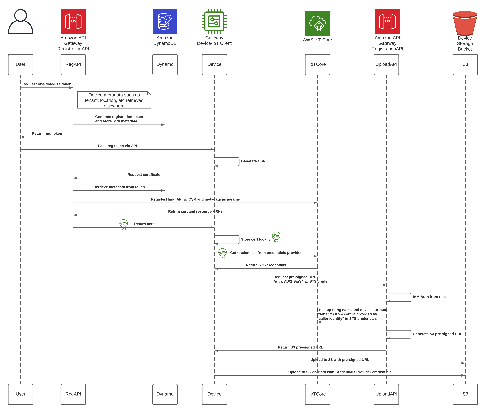
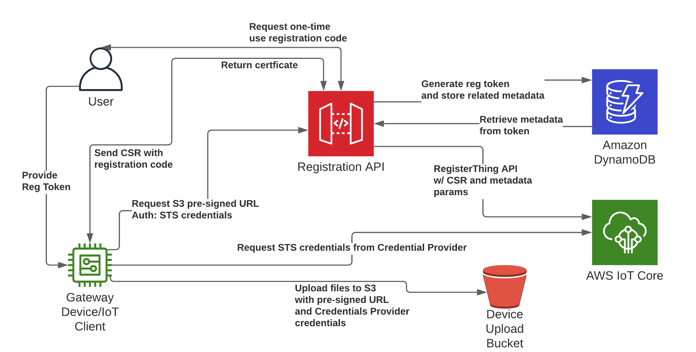

# Device Provisioning via Sideloaded Registration Codes

## Summary

This sample provides an end-to-end demo of using a single-use, short expiry registration code to provision devices by 
sideloading the registration code via a local web service running on the device. The device can then use that 
registration code to authenticate itself and initialize the provisioning process. This solves a common use-case of 
transferring trust from an authenticated user to a device so the device can provision itself asynchronously. 

This sample also contains some useful code snippets/libraries to demo the following:
1. CDK integration with Chalice to deploy API Gateway APIs, Lambda functions, DynamoDB tables, and S3 buckets
2. Narrowly scoped IoT policies with policy variables and AWS IoT Credential Provider permissions
3. AWS IoT Credential Provider API calls
4. IAM Role with AWS IoT Credential Provider Policy Variables
5. AWS SigV4 Authentication for API Gateway API calls

### Architecture Overview

Below is a sequence diagram and overview diagram for this sample.

### AWS Services Used
- AWS API Gateway
- AWS Lambda
- Amazon DynamoDB
- AWS Lambda
- AWS IoT Credential Provider
- AWS CDK
- AWS Chalice

### Difficulty Level
300

### Prerequisites

- Admin-level permissions due to the creation of IAM resources
- Python or Docker installed

## Set Up

### Project layout

This project has 2 parts: The IoT Client and the Registration API.

The registration API portion includes a CDK application and a Chalice application. These correspond to a 
``infrastructure`` and ``runtime`` directory respectively.  To run any CDK CLI commands, ensure you're in the
``infrastructure`` directory, and if you need to run any Chalice CLI commands, which you won't for this demo, ensure
you're in the ``runtime`` directory.

The IoT client portion consists the client itself with the AWS IoT Python SDK, the aws_auth library for AWS SigV4 auth,
the requirements file with the required dependencies, and the Dockerfile. These are all stored under the `client`
directory.

### Infrastructure and API deployment

First, you'll need to install the AWS CDK if you haven't already. The CDK requires Node.js and npm to run.
See the [Getting started with the AWS CDK](https://docs.aws.amazon.com/cdk/latest/guide/getting_started.html) for
more details.

`npm install -g aws-cdk`

Next you'll need to install the dependencies for the CDK deployment.

There are two ways to do this. Either globally from the standard shell or using a virtual environment such as `pipenv`

#### Installing dependencies with pipenv

The recommended way to install Python dependencies is with a virtual environment such as Pipenv. There's an included Pipfile
with the repo that you can use to install all dependencies to run the client. First you'll need to make sure Pipenv is installed.
https://pipenv.pypa.io/en/latest/install/

Then you can use pipenv to install all the Python dependencies.

`pipenv install`

Once all dependencies are installed, you'll need to activate the shell with `pipenv shell`

#### Installing Dependencies Globally

From the root directory, switch to the `api` directory with `cd api` and then run `pip install -r requirements.txt`

### Deploying Code

Once the dependencies are installed, to work with the CDK and deploy your application, you'll need to change directories
to the ``infrastructure`` directory.

1. If this is you're first time using the CDK you'll need to bootstrap your AWS account with the resouces the CDK needs.

`cdk bootstrap`

2. Now you're ready to deploy your application.

`cdk deploy`

Note: During deployment, the CDK will ask you to approve of the changes being created by CloudFormation, make sure to 
type `y` when prompted.

3. There will be two pieces of infrastructure left to manually provision that can not be deployed with CloudFormation, 
and that's the AWS IoT Credential Provider role alias and the AWS IoT Thing Types.

    1. The creation of the role alias can not be done via the console and must be done via a CLI command:
    `aws iot create-role-alias --role-alias <tenant> --role-arn <Role arn from CDK template>`
    You'll be using a fake "tenant" as the role alias name. In our case, that tenant name is `acme`.
    The role arn should come from the `AWSIoTCredentialProviderRole` role that was deployed with the CloudFormation template.

    2. You'll also need to go into the AWS IoT Console and create a Thing Type. This should be named `deviceTypeA`.
    These Thing Types do not need any configuration other than their names.

### IoT Client Configuration

The IoT client can either be run as a Docker container or a native Python application. In both cases, you'll need to ensure
the correct environment variables are configured. These are:

`IOT_ENDPOINT` - PREFIX ONLY (everything before ".iot" or "-ats.iot"). This can be found under "Settings" in the IoT 
console or by running `aws iot describe-endpoint` in the AWS CLI

`CREDENTIALS_ENDPOINT` - PREFIX ONLY (everything before ".credentials"). This can only be found by running 
`aws iot describe-endpoint --endpoint-type iot:CredentialProvider` in the AWS CLI

`AWS_DEFAULT_REGION` - Eg. us-east-1

`REG_API` - Endpoint of Registration API (eg. https://abc123.execute-api.us-east-1.amazonaws.com)

A sample Docker environment file has been included if you choose to run the client in Docker.

#### Option A - Running natively in Python:

1. Download the AWS IoT CA server certificate from [here](https://www.amazontrust.com/repository/AmazonRootCA1.pem) and 
store it in the `client` directory. This will be used by the IoT client to trust the AWS IoT Core Device Gateway.
`wget -O client/AmazonRootCA1.pem https://www.amazontrust.com/repository/AmazonRootCA1.pem`

2. Make sure the correct environment variables mentioned above are configured. The exact commands to do
this might vary slightly between operating systems and runtime environments. But generally in standard Linux/Unix shells 
it's accomplished by running `$ export <KEY>=<VALUE>` for each environment variable.

3. With environment variables set, you're ready to start the client. The Python client requires no arguments passed to it.

`python iot_client.py`

#### Option B - Running in Docker

1. For running with docker, you'll need to build the container locally using the included Dockerfile.

`docker build -t <use any image tag name here> .`

2. Make sure the previously mentioned environment file has the correct values set and then `docker run` with the following command:

`docker run -p 5000:5000 --env-file docker.env -it <image tag>`

## Demo

Ensure all setup steps are complete, the API has been provisioned successfully, and the IoT client pre-requisites have 
been installed. 

### Overview
The overview of the demo steps are as follows:

1. Start IoT client
2. Make API call to get registration token
3. Pass registration token to local IoT client
4. The IoT client will then do the rest on its own including:
    1. Call the Registration API with the token to get a certificate
    2. Initialize the MQTT client with the certificate
    3. Call the AWS IoT Credentials Provider to receive AWS STS credentials
    4. Call the Registration API with a SigV4 authentication header derived from the STS credentials 
    to receive an S3 pre-signed URL
    5. Upload sample data to the S3 bucket created in the CloudFormation stack using the S3 pre-signed URL (object key: acme/<thing name>/sample)
    6. Upload sample data to the same S3 bucket using the standard Boto3 SDK with the permissions provided by the 
    AWS IoT Credentials Provider (object key: <thing name>/sample)

### Detailed steps
1. Local IoT client should already be started by this point
2. You will need to make a "GET" request to the registration API to get a token. When this request is made, the API will 
generate a token as well as dummy metadata including "tenant", "location", "deviceType", and save it all to a DynamoDB table. 
The URL for the request is: <Registration API endpoint from CloudFormation stack>/api/token
`curl <endpoint>/api/token`
  
3. Copy the token out of the response from the previous request and use it to create a "POST" request to the local IoT client. 
Please note the token expires in 5 minutes. The URL for this request is `127.0.0.1:5000/regToken`. 
The body should be JSON and the structure is: `{"registrationCode": "<value>"}`

`curl --request POST '127.0.0.1:5000/regToken' --header 'Content-Type: application/json' \
--data-raw '{"registrationCode": <token from previous request>}'`

The registration token will then be used by the Registration API to authenticate the device and retrieve a certificate 
issued by AWS IoT Core. Once The IoT client has the certificate, and the device has been registered, it will complete 
the demo as previously described. 

4. You'll know everything was successful when the last output from the IoT client is 
`Successfully uploaded object to S3 via Boto`. Open the S3 bucket that was created in the CloudFormation template and 
confirm that the sample data is shown there with a key prefix of `<tenant>/<thing_name>/sample_data_`.

## Cleanup

1) Delete all items out of DynamoDB
2) Delete all objects out of S3
3) Delete CloudFormation stack
4) Delete AWS IoT Thing Types
5) Delete AWS IoT Role Aliases

## Security

See [CONTRIBUTING](CONTRIBUTING.md#security-issue-notifications) for more information.

## License

This library is licensed under the MIT-0 License. See the LICENSE file.

